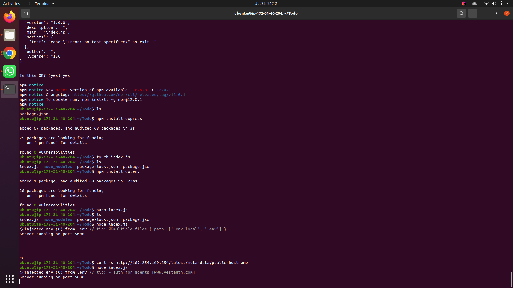
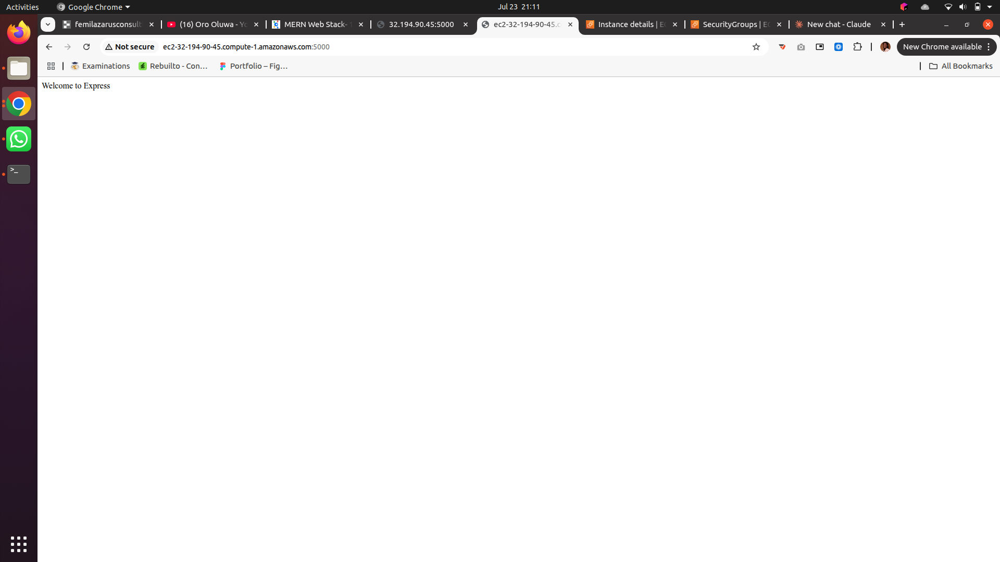
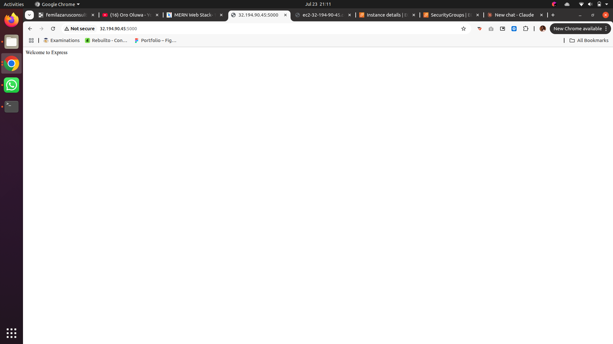
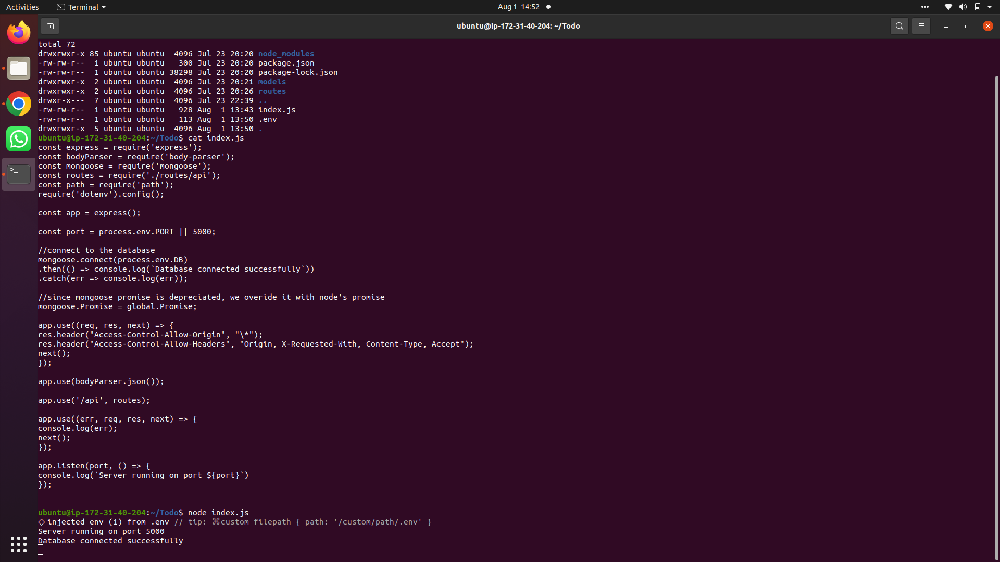
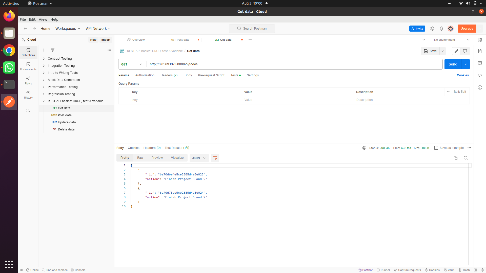
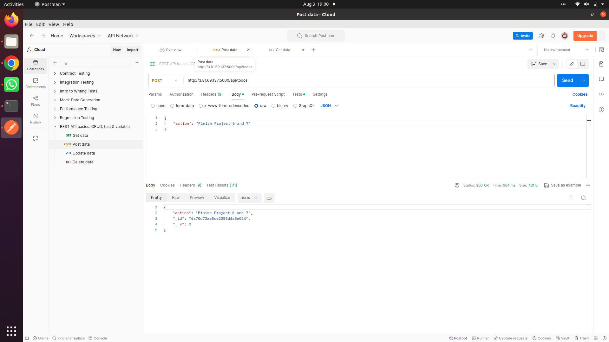
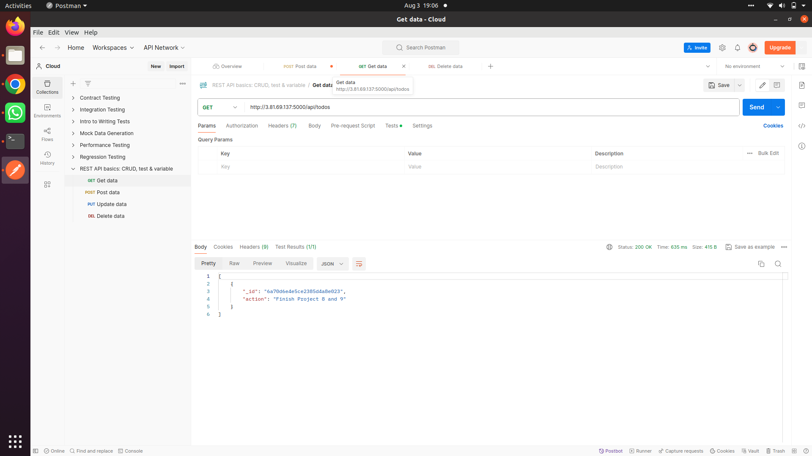
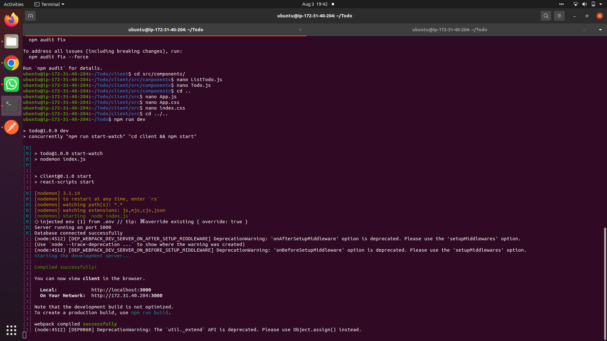
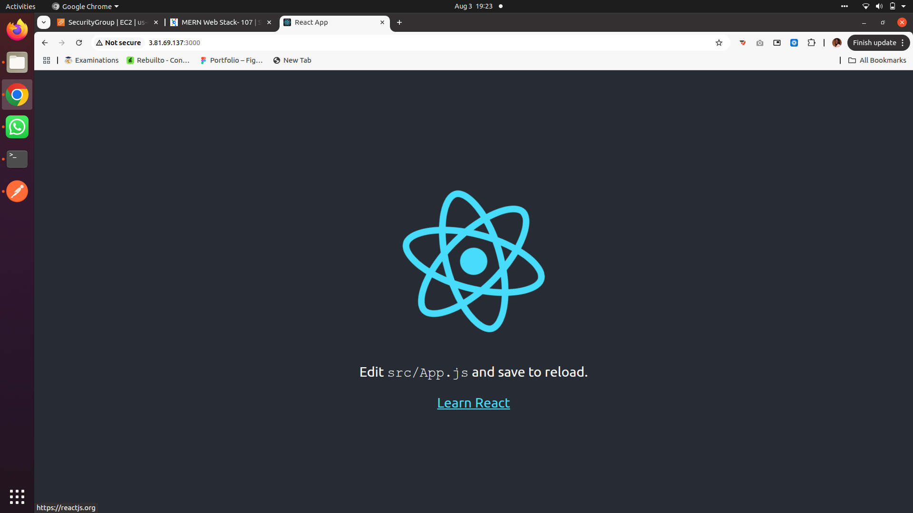
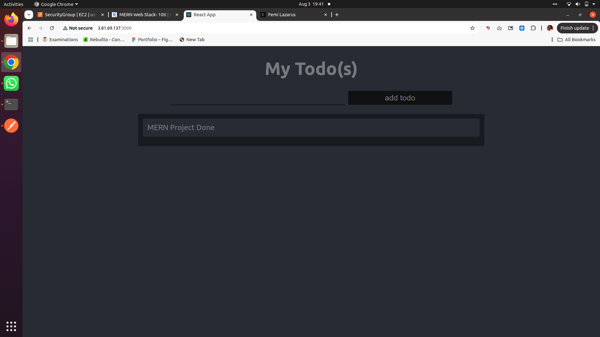

# MERN Stack To-Do Application

A full-stack To-Do list application built using the **MERN** stack — **M**ongoDB, **E**xpress.js, **R**eact.js, and **N**ode.js — deployed on an AWS EC2 (Ubuntu) instance, with MongoDB Atlas as the cloud database.

This project demonstrates a complete CRUD (Create, Read, Update, Delete) workflow: a Node/Express backend exposing a REST API, a MongoDB Atlas database for persistence, and a React frontend for the user interface.

---

## Table of Contents

- [Tech Stack](#tech-stack)
- [Project Architecture](#project-architecture)
- [Step 1 — Backend Configuration](#step-1--backend-configuration)
  - [Server Setup](#server-setup)
  - [Application Code Setup](#application-code-setup)
  - [Installing Express](#installing-express)
  - [Creating Routes](#creating-routes)
- [Database Setup — MongoDB Atlas](#database-setup--mongodb-atlas)
- [Models](#models)
- [Step 2 — Frontend Creation](#step-2--frontend-creation)
  - [Running the React App](#running-the-react-app)
  - [Configuring the Proxy](#configuring-the-proxy)
- [Testing the Backend with Postman](#testing-the-backend-with-postman)
- [Running the Full Application](#running-the-full-application)
- [Environment Variables](#environment-variables)
- [Author](#author)

---

## Tech Stack

| Layer | Technology |
|---|---|
| Frontend | React.js |
| Backend | Node.js, Express.js |
| Database | MongoDB (Atlas) |
| ODM | Mongoose |
| API Testing | Postman |
| Hosting | AWS EC2 (Ubuntu) |

---

## Project Architecture

```
Todo/
├── index.js              # Express server entry point
├── .env                   # Environment variables (not committed)
├── models/
│   └── todo.js            # Mongoose schema & model
├── routes/
│   └── api.js              # REST API routes (GET, POST, DELETE)
└── client/                # React frontend
    └── src/
        ├── App.js
        ├── App.css
        ├── index.css
        └── components/
            ├── Input.js
            ├── ListTodo.js
            └── Todo.js
```

---

## Step 1 — Backend Configuration

### Server Setup

Update and upgrade the Ubuntu server:

```bash
sudo apt update
sudo apt upgrade
```

Add the Node.js package repository and install Node.js (which comes bundled with `npm`):

```bash
curl -fsSL https://deb.nodesource.com/setup_22.x | sudo -E bash -
sudo apt-get install -y nodejs
```

Verify the installation:

```bash
node -v
npm -v
```

### Application Code Setup

Create a project directory and initialize it with `npm`:

```bash
mkdir Todo
cd Todo
npm init
```

Follow the prompts (press `Enter` to accept defaults, then type `yes` to confirm) — this generates a `package.json` file.

### Installing Express

Install Express and create the server entry file:

```bash
npm install express
touch index.js
npm install dotenv
```

Paste the following into `index.js`:

```js
const express = require('express');
require('dotenv').config();

const app = express();

const port = process.env.PORT || 5000;

app.use((req, res, next) => {
  res.header("Access-Control-Allow-Origin", "*");
  res.header("Access-Control-Allow-Headers", "Origin, X-Requested-With, Content-Type, Accept");
  next();
});

app.use((req, res, next) => {
  res.send('Welcome to Express');
});

app.listen(port, () => {
  console.log(`Server running on port ${port}`)
});
```

Start the server:

```bash
node index.js
```


*Installing Express and dotenv, creating `index.js`, and confirming the server starts on port 5000.*

Open **TCP port 5000** in the EC2 instance's Security Group (Inbound Rules), then visit the server's public IP or public DNS on port 5000 in a browser:

```
http://<PublicIP-or-PublicDNS>:5000
```


*Confirming the Express server responds over the public DNS name.*


*Confirming the Express server responds over the public IP address.*

### Creating Routes

The To-Do app supports three actions: **create** a task, **display** all tasks, and **delete** a task — mapped to `POST`, `GET`, and `DELETE` HTTP methods respectively.

Create a `routes` folder and an `api.js` file inside it:

```bash
mkdir routes
cd routes
touch api.js
```

Paste the following into `routes/api.js`:

```js
const express = require('express');
const router = express.Router();

router.get('/todos', (req, res, next) => {

});

router.post('/todos', (req, res, next) => {

});

router.delete('/todos/:id', (req, res, next) => {

})

module.exports = router;
```

---

## Database Setup — MongoDB Atlas

Instead of a local database, this project uses **MongoDB Atlas** — a fully managed, cloud-hosted MongoDB service — for the database layer.

1. Sign up for a free account at [MongoDB Atlas](https://www.mongodb.com/cloud/atlas/register).
2. Create an **M0 (Free Tier)** cluster, choosing a cloud provider and region.
3. Under **Database Access**, create a database user with a username and password.
4. Under **Network Access**, add an IP Access List entry of `0.0.0.0/0` to **allow access from anywhere** (not secure for production, but ideal for testing/development).
5. Click **Connect → Drivers**, select **Node.js**, and copy the provided connection string.
6. Add the connection string to a `.env` file in the project root:

```
DB=mongodb+srv://<username>:<password>@<cluster-address>/<dbname>?retryWrites=true&w=majority
PORT=5000
```

7. Update `index.js` to connect to the database using Mongoose:

```js
const mongoose = require('mongoose');

mongoose.connect(process.env.DB)
  .then(() => console.log('Database connected successfully'))
  .catch(err => console.log(err));

mongoose.Promise = global.Promise;
```


*Server starting up and confirming a successful connection to the MongoDB Atlas database.*

---

## Models

Since MongoDB is schema-less by nature, [Mongoose](https://mongoosejs.com/) is used to define a schema and model — a blueprint describing what fields each document in the database should have.

Install Mongoose and create a `models` folder:

```bash
npm install mongoose
mkdir models && cd models && touch todo.js
```

Paste the following into `models/todo.js`:

```js
const mongoose = require('mongoose');
const Schema = mongoose.Schema;

// create schema for todo
const TodoSchema = new Schema({
  action: {
    type: String,
    required: [true, 'The todo text field is required']
  }
})

// create model for todo
const Todo = mongoose.model('todo', TodoSchema);

module.exports = Todo;
```

Update `routes/api.js` to use the new model for all CRUD operations:

```js
const express = require('express');
const router = express.Router();
const Todo = require('../models/todo');

router.get('/todos', (req, res, next) => {
  // returns all data, exposing only the id and action field to the client
  Todo.find({}, 'action')
    .then(data => res.json(data))
    .catch(next)
});

router.post('/todos', (req, res, next) => {
  if (req.body.action) {
    Todo.create(req.body)
      .then(data => res.json(data))
      .catch(next)
  } else {
    res.json({
      error: "The input field is empty"
    })
  }
});

router.delete('/todos/:id', (req, res, next) => {
  Todo.findOneAndDelete({ "_id": req.params.id })
    .then(data => res.json(data))
    .catch(next)
})

module.exports = router;
```

---

## Testing the Backend with Postman

Before building the frontend, the API endpoints were tested independently using [Postman](https://www.postman.com/downloads/).

**GET** `http://<PublicIP-or-PublicDNS>:5000/api/todos` — retrieves all existing to-do items.


*Fetching all to-do items from the database via a GET request.*

**POST** `http://<PublicIP-or-PublicDNS>:5000/api/todos` — adds a new task (with header `Content-Type: application/json` and a JSON body, e.g. `{ "action": "Finish Project 6 and 7" }`).


*Adding a new to-do item via a POST request, with the created document returned in the response.*

**DELETE** `http://<PublicIP-or-PublicDNS>:5000/api/todos/:id` — deletes a task by its `_id`.


*Deleting a to-do item by ID via a DELETE request.*


*Confirming the item was removed by sending another GET request.*

All three core operations were verified as working:

- [x] Display a list of tasks — HTTP `GET`
- [x] Add a new task to the list — HTTP `POST`
- [x] Delete an existing task from the list — HTTP `DELETE`

---

## Step 2 — Frontend Creation

With the backend and API fully functional, the React frontend was scaffolded using `create-react-app` from the project's root `Todo` directory:

```bash
npx create-react-app client
```

This creates a `client` folder containing all the React code.

### Running the React App

Install two additional dev dependencies in the `Todo` root:

```bash
npm install concurrently --save-dev
npm install nodemon --save-dev
```

- **concurrently** — runs the backend and frontend servers simultaneously from one terminal.
- **nodemon** — automatically restarts the backend server on code changes.

Update the `scripts` section of the root `package.json`:

```json
"scripts": {
  "start": "node index.js",
  "start-watch": "nodemon index.js",
  "dev": "concurrently \"npm run start-watch\" \"cd client && npm start\""
},
```

### Configuring the Proxy

To avoid repeating the full backend URL in every frontend API call, a proxy was added to `client/package.json`:

```json
"proxy": "http://localhost:5000"
```

This allows the React app to call `/api/todos` directly instead of `http://localhost:5000/api/todos`.

**React Components** — three components were created inside `client/src/components/`:

- `Input.js` — handles the input field and adding a new todo (via Axios `POST`)
- `ListTodo.js` — renders the list of todos and handles deletion (via Axios `DELETE`)
- `Todo.js` — the parent component that fetches todos on mount (via Axios `GET`) and composes `Input` and `ListTodo`

`App.js` and styling (`App.css`, `index.css`) were also updated to render the `Todo` component and give the UI a clean, dark theme.

---

## Running the Full Application

From the `Todo` root directory, both servers are started together with:

```bash
npm run dev
```


*`concurrently` launching both the Express server (via `nodemon`) and the React dev server in a single terminal — the database also connects successfully on startup.*

TCP port **3000** must also be opened on the EC2 instance's Security Group to access the React app from the internet.


*The default `create-react-app` landing page confirming the frontend is running successfully on port 3000.*


*The finished To-Do application — able to add and display tasks, fully connected to the Express API and MongoDB Atlas database.*

---

## Environment Variables

This project uses a `.env` file to store sensitive configuration and keep it out of version control:

```
DB=mongodb+srv://<username>:<password>@<cluster-address>/<dbname>?retryWrites=true&w=majority
PORT=5000
```
